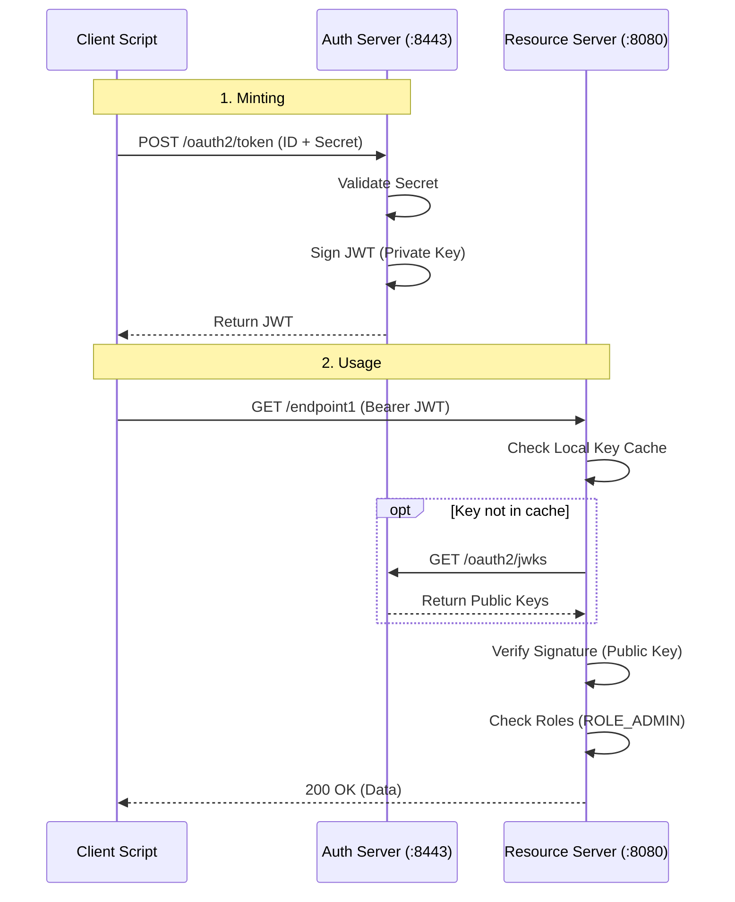
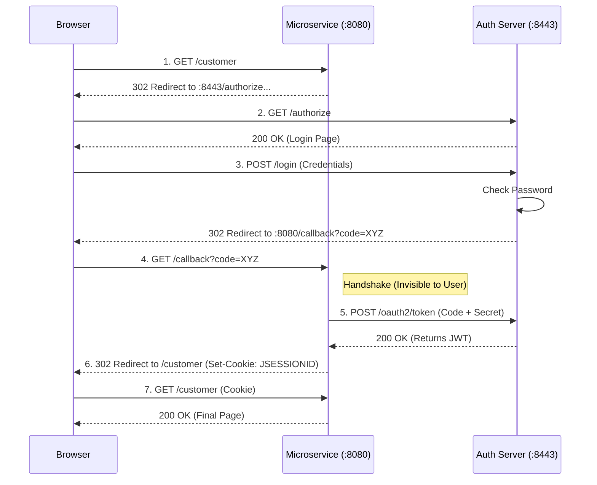

# Architecture Deep Dive

This document explains the **internal mechanics** of the Authentication and Resource servers. It goes beyond "how to use to it" and explains "how it works under the hood".

## 1. The Core Mechanism: Asymmetric Signing

The entire security model relies on **Asymmetric Cryptography** (RSA).

*   **Private Key**: Held *only* by the **Authorization Server**. Used to **Sign** tokens.
*   **Public Key**: Available to *everyone* (including the Resource Server). Used to **Verify** tokens.

> [!NOTE]
> **Common Confusion: Signing vs. Encryption**
> You might be thinking: *"Doesn't Public Key encrypt and Private Key decrypt?"*
>
> *   **Encryption (Confidentiality)**: Public encrypts -> Private decrypts. (e.g., Sending a secret message).
> *   **Signing (Authenticity - THIS PROJECT)**: Private signs -> Public verifies. (e.g., Proving who wrote the message).
>
> We are **Signing** (JWS), not Encrypting (JWE). That's why everyone can read it (Public Key verifies), but only Auth Server could have written it (Private Key signed).

### How Key Rotation Works (Unique to this Project)
In `AuthServerConfig.java`, there is a custom file-based rotation mechanism:

1.  **Check Timestamp**: On startup, it checks `keys/key_timestamp.txt`.
2.  **Rotate if Old**: If the key is older than 24 hours:
    *   It moves the current keys to `keys/archive/`.
    *   It generates a NEW RSA 2048-bit key pair (Private + Public).
    *   It overwrites **BOTH** `keys/private_key.pem` and `keys/public_key.pem`.
3.  **Serve JWKS**: The active Public Key is exposed at `http://localhost:8443/oauth2/jwks`.

## 2. Token Issuance (The "Minting" Process)

When you request a token, `AuthServerConfig` does the following:

1.  **Authenticate**: Checks Client ID/Secret or User/Password.
2.  **Customize Token**: The `jwtTokenCustomizer` bean injects custom data:
    ```java
    // Code snippet from AuthServerConfig.java
    context.getClaims().claim("roles", clientInfo.getRoles());
    context.getClaims().claim("subject_type", "client");
    ```
3.  **Sign**: It takes the JSON payload and signs it using the current **Private Key**.
4.  **Issue**: Returns the signed JWT string (Access Token).

### Example: What actually gets signed?

**1. The Header (Meta-data)**
```json
{
  "alg": "RS256",             // Algorithm: RSA Signature with SHA-256
  "kid": "b624...da61",       // Key ID: Matches the Public Key ID
  "typ": "JWT"
}
```

**2. The Payload (The Data)**
*This is the part `AuthServerConfig` customized.*
```json
{
  "sub": "webapp",                   // Subject (Client ID or Username)
  "aud": "microservice1",            // Audience
  "roles": ["ROLE_ADMIN"],           // <--- Injected by us
  "subject_type": "client",          // <--- Injected by us
  "scope": "read write",
  "exp": 1709283000                  // Expiration Timestamp
}
```

**3. The Signing (The Math)**
The Auth Server takes its **Private Key** and calculates:
`Signature = RSA_Sign(SHA256(Base64(Header) + "." + Base64(Payload)), PrivateKey)`

**4. The Final Token**
`eyJhbGciOiJSUz...` . `eyJzdWIiOiJ3Z...` . `ZO7_3a...`
(Header) . (Payload) . (Signature)

> [!CAUTION]
> **Crucial Concept: ENCODED, NOT ENCRYPTED**
> The Header and Payload are **NOT encrypted**. They are just **Base64 Encoded** (like putting text in a clear plastic bag).
>
> *   **Anyone** can decode and read them (using `jwt.io` or `base64` command).
> *   **Do NOT** put passwords or secrets inside the Payload.
> *   The **Signature** is the only part that prevents tampering. If a hacker changes the Payload, the Signature math won't match anymore.

## 3. Token Validation (The "Lock" Mechanism)

In `microservice1`, the `SecurityConfig.java` sets up the validation logic. This happens automatically for every request:

1.  **Intercept**: The `BearerTokenAuthenticationFilter` intercepts the request.
2.  **Decode**: It parses the JWT strings.
3.  **Fetch Key**:
    *   It looks at the `kid` (Key ID) header in the JWT.
    *   It checks its **Local Cache**.
    *   *Cache Miss?* It calls `http://localhost:8443/oauth2/jwks` to get the latest Public Keys.
4.  **Verify Signature**: It uses the Public Key to mathematically verify that the signature matches the payload. **If this passes, the token is authentic.**
5.  **Convert to Authorities**:
    *   The `JwtAuthenticationConverter` extracts the `roles` list (e.g., `["ROLE_ADMIN"]`).
    *   It converts them to Spring Security `GrantedAuthority` objects.
6.  **Authorize**: Finally, `@PreAuthorize("hasRole('ADMIN')")` checks if the required authority exists.

### Example: Validation Walkthrough

**Scenario**: User requests `GET /endpoint1` (Protected by `ROLE_ADMIN`).

1.  **Intercept**: Filter sees header `Authorization: Bearer eyJhbGci...`
2.  **Decode**: Parses header `{"kid": "b624...da61"}`.
3.  **Fetch Key & Verify**:
    *   Resource Server checks cache for `b624...da61`. *Found!*
    *   **The Math Check**:
        1.  Take received `Header` + `.` + `Payload`.
        2.  Calculate **New Hash**: `SHA256(Header + "." + Payload)`.
        3.  Take received `Signature`.
        4.  Use **Public Key** to decrypt Signature -> reveals **Original Hash**.
        5.  **Compare**: Does `New Hash` == `Original Hash`?
    *   **Result**: They Match! Token is authentic.

### Why does this Hash logic work?
It works because of the **RSA Mirror Property**:
1.  **The Rule**: Whatever is encrypted with the **Private Key** can *only* be decrypted by the **Public Key**.
2.  **The Proof**:
    *   If the Public Key successfully decrypts the Signature to reveal a valid Hash, it **PROVES** that the specific Private Key was used to create it.
    *   If a hacker used a fake private key, your Public Key would fail to decrypt it (or it would decrypt into garbage).
    *   If a hacker changed the content, the `New Hash` would be different, and the `==` check would fail.

### Simplified Math Example (The Magic of RSA)
Let's use tiny numbers to show how the "Mirror Property" works mathematically.

**Setup Keys**:
1.  **Public Key**: `(3, 33)`  *(Everyone knows this)*
2.  **Private Key**: `(7, 33)` *(Only Auth Server knows this)*

**The Process**:
1.  **Auth Server (Sign)**:
    *   Calculates Hash = `4`
    *   Formula: `Hash ^ PrivateKey % 33`
    *   Calculation: `4 ^ 7 = 16384`. `16384 % 33 = 16`
    *   **Signature = 16**

2.  **Resource Server (Verify)**:
    *   Receives Hash `4` (calculated from content) and Signature `16`.
    *   Formula: `Signature ^ PublicKey % 33`
    *   Calculation: `16 ^ 3 = 4096`. `4096 % 33 = 4`
    *   **Result = 4**

3.  **The Match**:
    *   Does `4` (Decrypted Signature) == `4` (Calculated Hash)?
    *   **YES!** This proves the signature `16` could *only* have been made by the number `7` (Private Key). If you used any other number, the result wouldn't be `4`.

---

4.  **Convert**:
    *   Finds claim: `"roles": ["ROLE_ADMIN"]`
    *   Creates Java Object: `new SimpleGrantedAuthority("ROLE_ADMIN")`
5.  **Authorize**:
    *   Endpoint validation: `hasRole('ADMIN')`?
    *   User authorities: `[ROLE_ADMIN]`
    *   **MATCH!** -> Returns 200 OK.

## 4. Authorization Code Flow (Detailed Deep Dive)

This flow is special because it involves the **User**, the **Browser**, and **Two Redirects**.

### Why "Redirects"? (The "Candy Crush" Analogy)
Because the User trusts the *Browser*, but they shouldn't trust the Application (microservice1) with their password.

**Think of it like this:**
*   **The App (`microservice1`) is "Candy Crush"**: A game you installed.
*   **The Auth Server (`:8443`) is "The Bank"**: Where your money/identity lives.

**If there were NO Redirects:**
You would have to type your **Banking Password** directly into the **Candy Crush App**. You'd have to trust that the game developer isn't saving your password to a text file to steal your money.

**WITH Redirects (How it actually works):**
1.  Candy Crush says "I need to check your balance."
2.  It **Redirects** you to the **Bank's Website**.
3.  You type your password on `bank.com` (The Auth Server). Candy Crush *cannot* see this.
4.  The Bank validates you and sends Candy Crush a **Token** (Authorization Code) that says *"Allowed to check balance only"*.
5.  Candy Crush uses that token. It never saw your password.

### The 6-Step Dance

**Step 1. Access Attempt**
*   **User**: Clicks link to `http://localhost:8080/customer`
*   **Microservice**: "I see no session cookie!" -> Triggers `oauth2Login`
*   **Action**: Redirects Browser to Auth Server.
    *   *URL*: `http://localhost:8443/oauth2/authorize?client_id=webapp&response_type=code...`

**Step 2. Authentication**
*   **Browser**: Loads the Login Page from port **8443**.
*   **User**: Types `john.doe` / `password123`.
*   **Auth Server**: Validates password against `users.csv`. Checks if valid.

**Step 3. Code Generation (The "Ticket")**
*   **Auth Server**: Generates a temporary, one-time **Authorization Code** (e.g., `abc-123`).
*   **Action**: Redirects Browser *BACK* to the Microservice.
    *   *URL*: `http://localhost:8080/login/oauth2/code/webapp?code=abc-123`

**Step 4. The Exchange (Back-Channel)**
*   **Microservice**: Receives the request with `code=abc-123`.
*   **Microservice**: Checks who it is. "Ah, this is a response for the 'webapp' client".
*   **Microservice (Backend)**: Makes a hidden DIRECT POST request to Auth Server (`:8443`).
    *   *Sends*: `code=abc-123`, `client_id=webapp`, `client_secret=webappSecret`
    *   *Note*: The Browser *never* sees this step. It's server-to-server.

**Step 5. Token Issuance**
*   **Auth Server**:
    1.  Validates the Code `abc-123`.
    2.  Validates the Secret `webappSecret`.
    3.  **Mints the JWT** (as described in Section 2).
*   **Auth Server**: Returns the JWT to Microservice.

**Step 6. Session Creation**
*   **Microservice**:
    1.  Receives JWT.
    2.  Creates a **Session Cookie** (`JSESSIONID`) that represents this logged-in state.
    3.  Stores the JWT inside that session memory.
*   **Microservice**: Redirects Browser to original destination: `/customer`.

Now, for future requests, the Browser sends the `JSESSIONID`, and the Microservice knows "Oh, that's John Doe, and I have his JWT right here in memory."

## 5. Sequence Diagrams

### Flow A: Client Credentials (Machine-to-Machine)

**Payload Example:**
```json
{
  "sub": "admin-script",
  "roles": ["ROLE_ADMIN"],
  "subject_type": "client"
}
```



### Flow B: Authorization Code (User Login)

**Payload Example:**
```json
{
  "sub": "john.doe",
  "roles": ["ROLE_USER", "ROLE_CUSTOMER"],
  "subject_type": "user",
  "username": "john.doe"
}
```


