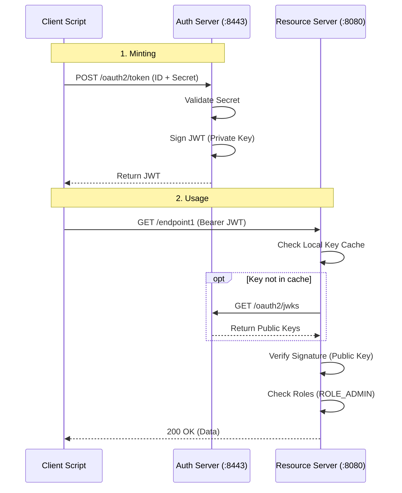
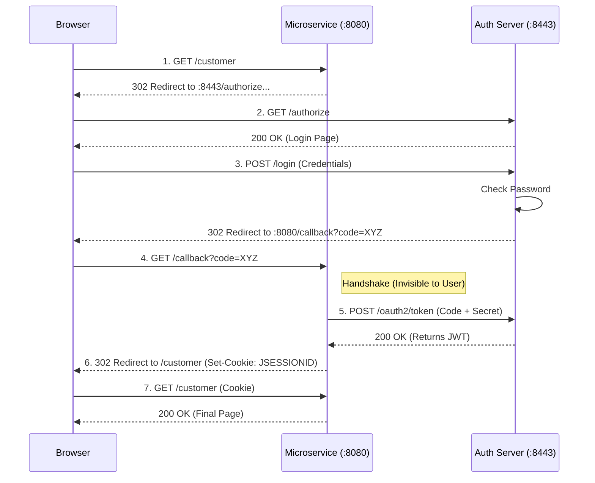

# Architecture Deep Dive

This document explains the **internal mechanics** of the Authentication and Resource servers. It goes beyond "how to use to it" and explains "how it works under the hood".

## 1. The Core Mechanism: Asymmetric Signing

The entire security model relies on **Asymmetric Cryptography** (RSA).

*   **Private Key**: Held *only* by the **Authorization Server**. Used to **Sign** tokens.
*   **Public Key**: Available to *everyone* (including the Resource Server). Used to **Verify** tokens.

### How Key Rotation Works (Unique to this Project)
In `AuthServerConfig.java`, there is a custom file-based rotation mechanism:

1.  **Check Timestamp**: On startup, it checks `keys/key_timestamp.txt`.
2.  **Rotate if Old**: If the key is older than 24 hours:
    *   It moves the current keys to `keys/archive/`.
    *   It generates a NEW RSA 2048-bit key pair.
    *   It overwrites `keys/private_key.pem`.
3.  **Serve JWKS**: The active Public Key is exposed at `http://localhost:8443/oauth2/jwks`.

## 2. Token Issuance (The "Minting" Process)

When you request a token, `AuthServerConfig` does the following:

1.  **Authenticate**: Checks Client ID/Secret or User/Password.
2.  **Customize Token**: The `jwtTokenCustomizer` bean injects custom data:
    ```java
    // Code snippet from AuthServerConfig.java
    context.getClaims().claim("roles", clientInfo.getRoles());
    context.getClaims().claim("subject_type", "client");
    ```
3.  **Sign**: It takes the JSON payload and signs it using the current **Private Key**.
4.  **Issue**: Returns the signed JWT string (Access Token).

## 3. Token Validation (The "Lock" Mechanism)

In `microservice1`, the `SecurityConfig.java` sets up the validation logic. This happens automatically for every request:

1.  **Intercept**: The `BearerTokenAuthenticationFilter` intercepts the request.
2.  **Decode**: It parses the JWT strings.
3.  **Fetch Key**:
    *   It looks at the `kid` (Key ID) header in the JWT.
    *   It checks its **Local Cache**.
    *   *Cache Miss?* It calls `http://localhost:8443/oauth2/jwks` to get the latest Public Keys.
4.  **Verify Signature**: It uses the Public Key to mathematically verify that the signature matches the payload. **If this passes, the token is authentic.**
5.  **Convert to Authorities**:
    *   The `JwtAuthenticationConverter` extracts the `roles` list (e.g., `["ROLE_ADMIN"]`).
    *   It converts them to Spring Security `GrantedAuthority` objects.
6.  **Authorize**: Finally, `@PreAuthorize("hasRole('ADMIN')")` checks if the required authority exists.

## 4. Authorization Code Flow (Detailed Deep Dive)

This flow is special because it involves the **User**, the **Browser**, and **Two Redirects**.

### Why "Redirects"? (The "Candy Crush" Analogy)
Because the User trusts the *Browser*, but they shouldn't trust the Application (microservice1) with their password.

**Think of it like this:**
*   **The App (`microservice1`) is "Candy Crush"**: A game you installed.
*   **The Auth Server (`:8443`) is "The Bank"**: Where your money/identity lives.

**If there were NO Redirects:**
You would have to type your **Banking Password** directly into the **Candy Crush App**. You'd have to trust that the game developer isn't saving your password to a text file to steal your money.

**WITH Redirects (How it actually works):**
1.  Candy Crush says "I need to check your balance."
2.  It **Redirects** you to the **Bank's Website**.
3.  You type your password on `bank.com` (The Auth Server). Candy Crush *cannot* see this.
4.  The Bank validates you and sends Candy Crush a **Token** (Authorization Code) that says *"Allowed to check balance only"*.
5.  Candy Crush uses that token. It never saw your password.

### The 6-Step Dance

**Step 1. Access Attempt**
*   **User**: Clicks link to `http://localhost:8080/customer`
*   **Microservice**: "I see no session cookie!" -> Triggers `oauth2Login`
*   **Action**: Redirects Browser to Auth Server.
    *   *URL*: `http://localhost:8443/oauth2/authorize?client_id=webapp&response_type=code...`

**Step 2. Authentication**
*   **Browser**: Loads the Login Page from port **8443**.
*   **User**: Types `john.doe` / `password123`.
*   **Auth Server**: Validates password against `users.csv`. Checks if valid.

**Step 3. Code Generation (The "Ticket")**
*   **Auth Server**: Generates a temporary, one-time **Authorization Code** (e.g., `abc-123`).
*   **Action**: Redirects Browser *BACK* to the Microservice.
    *   *URL*: `http://localhost:8080/login/oauth2/code/webapp?code=abc-123`

**Step 4. The Exchange (Back-Channel)**
*   **Microservice**: Receives the request with `code=abc-123`.
*   **Microservice**: Checks who it is. "Ah, this is a response for the 'webapp' client".
*   **Microservice (Backend)**: Makes a hidden DIRECT POST request to Auth Server (`:8443`).
    *   *Sends*: `code=abc-123`, `client_id=webapp`, `client_secret=webappSecret`
    *   *Note*: The Browser *never* sees this step. It's server-to-server.

**Step 5. Token Issuance**
*   **Auth Server**:
    1.  Validates the Code `abc-123`.
    2.  Validates the Secret `webappSecret`.
    3.  **Mints the JWT** (as described in Section 2).
*   **Auth Server**: Returns the JWT to Microservice.

**Step 6. Session Creation**
*   **Microservice**:
    1.  Receives JWT.
    2.  Creates a **Session Cookie** (`JSESSIONID`) that represents this logged-in state.
    3.  Stores the JWT inside that session memory.
*   **Microservice**: Redirects Browser to original destination: `/customer`.

Now, for future requests, the Browser sends the `JSESSIONID`, and the Microservice knows "Oh, that's John Doe, and I have his JWT right here in memory."

## 5. Sequence Diagrams

### Flow A: Client Credentials (Machine-to-Machine)



### Flow B: Authorization Code (User Login)


