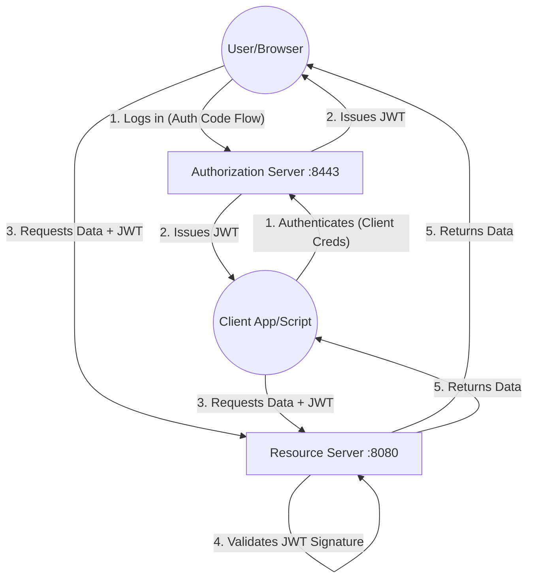

# System Design & Complete API Usage Guide

## System Design

This project follows a standard **OAuth2 Microservices Architecture**.



### Critical Concept: The "Key" (JWT)
Think of the **JWT** as a physical key card.
1.  **Auth Server (:8443)** is the "Front Desk". It mints the keys.
2.  **Resource Server (:8080)** is the "Hotel Room". It has a lock that only opens for valid keys. It *doesn't* call the Front Desk every time you open the door; it just checks if the key is valid.

---

## API Catalog (All Existing Endpoints)

There are exactly **7 endpoints** exposed by the Resource Server (`microservice1`).

### 1. Protected Data Endpoints (`MultiClientController`)
These are the core "business" endpoints protected by specific roles.

| Method | Endpoint | Required Role | Description |
|:---:|:---|:---|:---|
| `GET` | `/endpoint1` | `ROLE_ADMIN` | Admin-only data. |
| `GET` | `/endpoint2` | `ROLE_USER` | User/Staff data. |
| `GET` | `/endpoint3` | `ROLE_MANAGER` | Manager/Report data. |
| `GET` | `/customer` | `ROLE_CUSTOMER` | Customer specific data (User Profile). |

### 2. Frontend/Utility Endpoints (`OAuth2LoginController`)
These are used when accessing via a Browser (Human User).

| Method | Endpoint | Access | Description |
|:---:|:---|:---|:---|
| `GET` | `/` | Authenticated | **Home Page**. displays current user & authorities. |
| `GET` | `/token-info` | Authenticated | **Debug Tool**. Decodes the current session's JWT, shows expiry & scopes. |

### 3. Infrastructure Endpoints (`RedirectFixController`)

| Method | Endpoint | Description |
|:---:|:---|:---|
| `GET` | `/oauth2/authorize` | **Traffic Cop**. If you accidentally hit port :8080 for login, this redirects you to port :8443. |

---

## Detailed Usage & How It Works

### Scenario A: Machine-to-Machine (API Access)
*Used by: Scripts, Backend Services, Cron Jobs*

**How it works**:
1.  Script asks Auth Server for a token using ID/Secret.
2.  Script sends token to Resource Server.

**cURL Commands**:

#### 1. Admin Flow (Accessing `/endpoint1`)
```bash
# 1. Get Token (Inventory Client -> Role: ADMIN)
ADMIN_TOKEN=$(curl -s -X POST http://localhost:8443/oauth2/token \
  -u inventoryclient:secret123 \
  -d "grant_type=client_credentials" | jq -r '.access_token')

# 2. Access Admin Endpoint
curl http://localhost:8080/endpoint1 \
  -H "Authorization: Bearer $ADMIN_TOKEN"
```
*Result: `{"message":"Access Granted to Endpoint 1 (ADMIN)"...}`*

#### 2. User/Staff Flow (Accessing `/endpoint2`)
```bash
# 1. Get Token (CartOps Client -> Role: USER)
USER_TOKEN=$(curl -s -X POST http://localhost:8443/oauth2/token \
  -u cartopsclient:secret456 \
  -d "grant_type=client_credentials" | jq -r '.access_token')

# 2. Access User Endpoint
curl http://localhost:8080/endpoint2 \
  -H "Authorization: Bearer $USER_TOKEN"
```

#### 3. Manager Flow (Accessing `/endpoint3`)
```bash
# 1. Get Token (Reports Client -> Role: MANAGER)
MANAGER_TOKEN=$(curl -s -X POST http://localhost:8443/oauth2/token \
  -u reportsclient:secret789 \
  -d "grant_type=client_credentials" | jq -r '.access_token')

# 2. Access Manager Endpoint
curl http://localhost:8080/endpoint3 \
  -H "Authorization: Bearer $MANAGER_TOKEN"
```

---

### Scenario B: Human User (Browser Access)
*Used by: Real people in a web browser*

**How it works**:
1.  User visits `http://localhost:8080/customer`.
2.  User is **Redirected** to `http://localhost:8443/login`.
3.  User enters credentials.
4.  Auth Server redirects back to `:8080` with a code.
5.  Microservice exchanges code for JWT and creates a session.

**Manual Verification Steps**:
1.  Open Browser: `http://localhost:8080/customer`
2.  Login:
    *   **User**: `john.doe`
    *   **Pass**: `password123`
3.  You will see: `Welcome Customer! This is your dedicated endpoint.`

**Inspect your Token (The "Debug" Endpoint)**:
1.  After logging in, go to: `http://localhost:8080/token-info`
2.  This JSON response shows you exactly what "Keys" you are holding (Expiration time, Scopes, JWT Payload). It is extremely useful for debugging why access might be denied.
